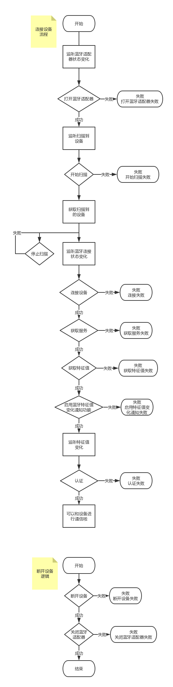

# 蓝牙产品开发经验分享
- 微信小程序连接蓝牙设备流程图和断开设备流程图，见结尾
- 打开／关闭蓝牙适配器建议成对调用，创建／断开设备连接建议成对调用，不需要搜索时要调用停止搜索（因为搜索设备比较耗费系统资源）
- Android 上获取到的deviceId为设备 MAC 地址，iOS 上则为设备 uuid，官方文档有隐蔽提供ios上获取mac的方法。

```javascript
// ArrayBuffer转16进度字符串示例
function ab2hex(buffer) {
  var hexArr = Array.prototype.map.call(
    new Uint8Array(buffer),
    function(bit) {
      return ('00' + bit.toString(16)).slice(-2)
    }
  )
  return hexArr.join('');
}
wx.onBluetoothDeviceFound(function(devices) {
  console.log('new device list has founded')
  console.dir(devices)
  console.log(ab2hex(devices[0].advertisData))
})
```
- 写入数据时，数据超过20个字节时要分包发送
- 要对各个环节的失败情况做处理，比如连接失败时，可以尝试几次重连。
- 要利用好监听函数，比如用户打开／关闭蓝牙的动作可以监听到，当监听到打开蓝牙时，就可以开始连接设备了。再比如监听到设备连接断开了，可以去重连。
- Android上连接设备经常出问题，有一些方法可以提高连接成功率。
  1. 重连，故名思议，连接失败后重新连接。举个例子：获取特征值失败时，可以重新获取特征值，没有必要断开连接，然后在创建连接等等。
  2. 安卓机型调用微信小程序api增加一点延时，尤其是连接成功到认证这个环节，举个例子：获取特征值成功后，可以延时50-300ms后再去启用监听特征值变化功能

## 蓝牙成品流程图
